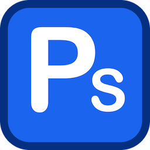
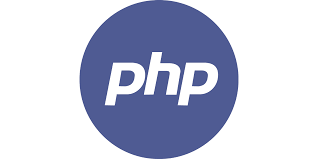

###  Hi there, I'm Saikal Dildemurat!  

---

For the last two years I have devoted a lot of time and energy to web development. 💻 So far I have  JavaScript, HTML, CSS, jQuery, Bootstrap, Git/GitHub, Wordpress and SASS/LESS under my belt. I've started learning React, Node.JS, MongoDB, and Express.JS. I'm still enthusiastically grabbing onto any other programming languages, frameworks, or principles I can integrate into the coding web in my head.
There's certainly yet more to learn, yet more problems to solve, and yet more to build. And for this, I am very grateful.
Feel free to reach out if you ever need any support, career guidance, or advice on those tricky things; we can get it done together.

So I'm a junior front-end developer. Feel free to contact me in case of any queries 🙌

---

## Skills

## Certification

- [Responsive Web Design-FreeCodeCamp](https://freecodecamp.org/certification/sdj/responsive-web-design)
  
- [JavaScript, часть 1: основы и функции-Coursera](https://freecodecamp.org/certification/sdj/responsive-web-design)
  
- [Use WordPress to Create a Blog for your Business-Coursera](https://www.coursera.org/account/accomplishments/certificate/GJH7LY8YFFMU)
 

<!--**Web development courses**-->

